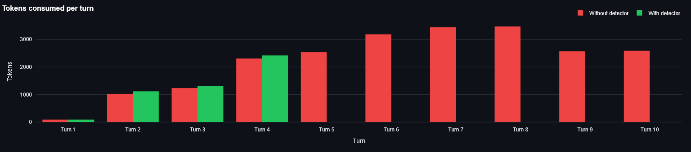

# Multi Agent Workflow Failure Detection

A Streamlit dashboard for benchmarking multi agent LLM workflows and detecting inefficient looping behaviour in real time.

The project compares a baseline workflow against a protected workflow that uses lightweight signals to stop wasteful iterations early and reduce token usage.

## What it does

* Runs a coder/reviewer multi-agent loop
* Tracks token usage and latency per turn
* Detects patterns such as repetition, stagnation, rejection loops, retry/error loops, and runaway escalation
* Compares a baseline run with a detector-enabled run
* Visualizes token growth and reviewer escalation over time

Multi agent workflows often keep refining long after the useful part is over. This project shows how to detect those inefficient trajectories without adding an extra LLM judge on every turn.

## Benchmark summary

The dashboard runs two versions of the same task:

1. **Baseline workflow** - runs normally until the max turn limit
2. **Protected workflow** - stops early when the detector flags a loop

The comparison highlights:

* turns saved
* tokens saved
* token growth per turn
* reviewer escalation behaviour

## Detection signals

The detector combines several lightweight signals:

* `repeat`
* `stagnation`
* `rejection_loop`
* `error_loop`
* `open_loop`
* `escalation`
* `latency`

These signals are combined to decide whether the workflow should stop early.

## How it works

1. A task prompt is sent to the coder agent.
2. The reviewer responds with feedback.
3. The detector watches the conversation for loop like patterns.
4. If the protected workflow crosses the threshold, execution stops early.
5. The dashboard compares both runs and shows the savings.

## Screenshot




## Setup

### 1. Create a virtual environment

```bash
python -m venv .venv
.venv\Scripts\activate
```

### 2. Install dependencies

```bash
pip install -r requirements.txt
```

### 3. Add your API key

Create a `.env` file in the project root:

```bash
NVIDIA_API_KEY=your_key_here
```

### 4. Run the dashboard

```bash
streamlit run app.py
```

## How to use

1. Enter a task prompt.
2. Optionally adjust the coder and reviewer system prompts.
3. Click **Run Benchmark**.
4. Compare the baseline run with the protected run.

## Interpreting the results

* Green rows show coder output.
* Blue rows show reviewer output.
* Red rows indicate the detector fired and the workflow stopped early.
* Tags on the baseline side show where the detector would have stopped.
* The bar chart shows token usage per turn.
* The reviewer chart shows how response size grows during refinement.

## Notes

* The detector uses lightweight heuristics rather than a second LLM judge.
* The benchmark is designed to show token savings and failure mode detection, not perfect semantic evaluation.
* The max turn limit is a safety cap, not the primary stopping mechanism.

